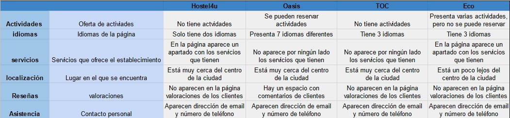
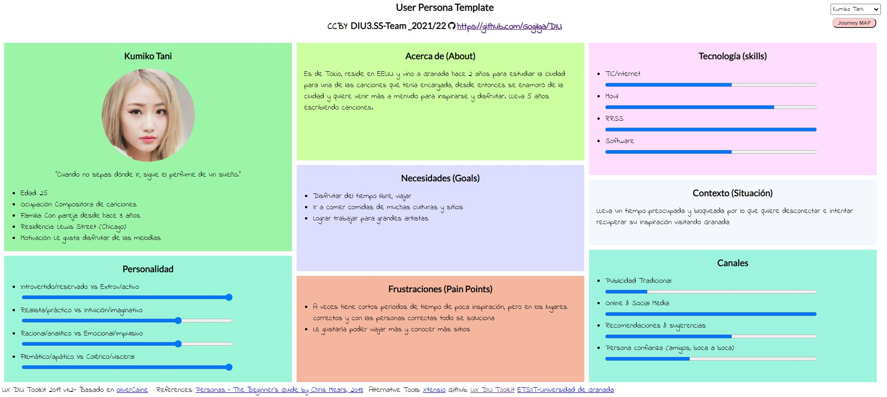
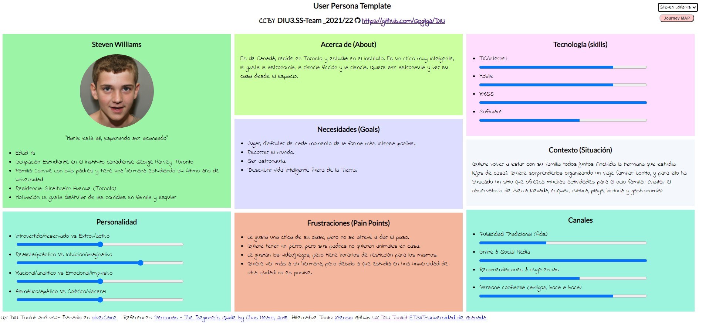
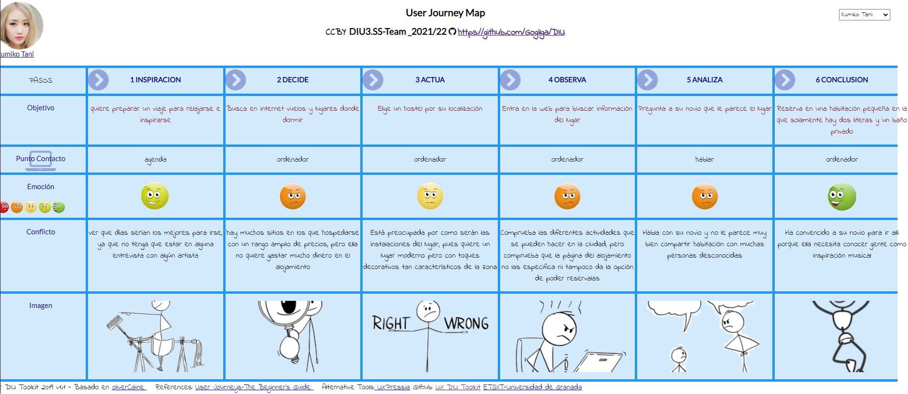

## DIU - Practica1

Grupo: DIU3.SS-Team.  Curso: 2021/22

Miembros
 * :bust_in_silhouette:  **Santiago Gil Legaza**    :octocat: https://github.com/Gogilga
 * :bust_in_silhouette:  **Salvador Megías Andreu**    :octocat: https://github.com/salvadorJMA

----- 

# Proceso de Diseño 

## Paso 1. UX Desk Research & Analisis 

1.a Competitive Analysis
-----

Hemos elegido 4 webs distintas de hostels en Granada, calificándolas sobre diversos aspectos como las actividades que puedan ofrecer dichos hostels a través de su website, los idiomas con los que se pueden dar a conocer, los servicios que ofrecen, la localización del hostel en la ciudad, las reseñas de otros clientes, y la calidad de la asistencia que ofrece el personal del hostel.

Teniendo en cuenta estas características, hemos evaluado individualmente a cada uno de los 4 hostels y hemos llegado a la conclusión de que, aunque de forma muy ajustada, la mejor website y por tanto el mejor hostel es Hostel4u, debido a su sencillez, intuitiva website, localización en la ciudad, servicios que ofrece y asistencia eficaz al cliente. 

1.b Persona
-----

La primera persona que hemos elegido se llama Kumiko Tani y se trata de una chica Japonesa que vive en EEUU que se dedica a escribir canciones, por lo que tiene que viajar mucho y al ser tan joven es más probable que pueda elegir cualquier tipo de alojamiento.

Para la segunda persona hemos decidido crear a Steven Williams, dado que nos parecía interesante crear una perspectiva no tan común como puede ser la de un adolescente Canadiense sin recursos monetarios propios que quiere darle una sorpresa a su familia y reunirlos de nuevo en este viaje tan ilusionante para él.

1.c User Journey Map
----

>>> Comenta brevemente porqué has escogido estas dos experiencias de usuario (y si consideras que son habituales) (80-150 caracteres)

1.d Usability Review
----
>>>  Revisión de usabilidad: (toma los siguientes documentos de referncia y verifica puntos de verificación de  usabilidad
>>>> SE deben incluir claramente los siguientes elementos
>>> - Enlace al documento:  (sube a github el xls/pdf) 
>>> - Valoración final (numérica): 
>>> - Comentario sobre la valoración:  (60-120 caracteres)

