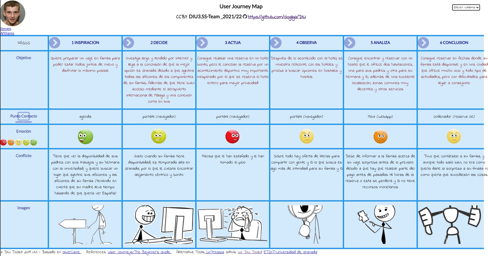

## DIU - Practica1

Grupo: DIU3.SS-Team.  Curso: 2021/22

Miembros
 * :bust_in_silhouette:  **Santiago Gil Legaza**    :octocat: https://github.com/Gogilga
 * :bust_in_silhouette:  **Salvador Megías Andreu**    :octocat: https://github.com/salvadorJMA

----- 

# Proceso de Diseño 

## Paso 1. UX Desk Research & Analisis 

1.a Competitive Analysis
-----

Hemos elegido 4 webs distintas de hostels en Granada, calificándolas sobre diversos aspectos como las actividades que puedan ofrecer dichos hostels a través de su website, los idiomas con los que se pueden dar a conocer, los servicios que ofrecen, la localización del hostel en la ciudad, las reseñas de otros clientes, y la calidad de la asistencia que ofrece el personal del hostel.

Los que hemos elegido son: 
- [Hostel4u](https://www.hostel4ugranada.com)
- [Oasis](https://oasisgranada.com/)
- [TOC](https://tochostels.com/destinations/granada/)
- [ECO](http://www.ecohostel.es)

Teniendo en cuenta estas características, hemos evaluado individualmente a cada uno de los 4 hostels y hemos llegado a la conclusión de que, aunque de forma muy ajustada, la mejor website y por tanto el mejor hostel es Hostel4u, debido a su sencillez, intuitiva website, localización en la ciudad, servicios que ofrece y asistencia eficaz al cliente. 

1.b Persona
-----

La primera persona que hemos elegido se llama Kumiko Tani y se trata de una chica Japonesa que vive en EEUU que se dedica a escribir canciones, por lo que tiene que viajar mucho y al ser tan joven es más probable que pueda elegir cualquier tipo de alojamiento.

Para la segunda persona hemos decidido crear a Steven Williams, dado que nos parecía interesante crear una perspectiva no tan común como puede ser la de un adolescente Canadiense sin recursos monetarios propios que quiere darle una sorpresa a su familia y reunirlos de nuevo en este viaje tan ilusionante para él.

El documento js con la información de las personas se puede encontrar [aquí](data/Persona.js).

1.c User Journey Map
----
Hemos escogido estas dos situaciones, debido a que no son situaciones de lo más comunes de los típicos turistas que quieren viajar. Sino que nuestros personajes tienen una finalidad subyacente.

La primera situación encontramos que Kumiko está en medio de un contrato con un artista muy famoso para escribir su próxima canción. Ella está pasando ahora mismo por un bloqueo en el que solo ha escrito la primera estrofa de la canción y necesita una fuente de inspiración de cualquier modo posible. Hace varios años viajó ya a Granada y le encantó la ciudad, por lo que decide volver a visitarla para poder inspirarse y conocer gente nueva que le de nuevas historias que poder contar.

En la segunda situación descrita encontramos al joven adolescente Steven Williams, cuya finalidad subyacente sería reunir de nuevo a su familia en un encomiable viaje lleno de actividades por y para la familia y que sean del agrado de su miembros. Dónde Granada, reúne los requisitos para satisfacer las necesidades e inquietudes de la familia Williams.

El documento js con la información de los Journey Map se puede encontrar [aquí](data/Journey.js).

1.d Usability Review
----

- Aquí se puede encontrar el [xlsx](Usability-review-template.xlsx) y el [pdf](Usability-review-template-2.pdf) de Usability Review
- **Nota:** 91/100.
- **Valoración:** Se ha obtenido una valoración excelente (91 sobre 100). Pensamos que la website ofrecida por el hostel “Hostel4u” es más que adecuada, por cierta salvedad de un problema de programación insignificante, pero que por otra parte ofrece al usuario una experiencia muy intuitiva y amigable desde el primer momento, con un contenido claro y conciso de todo lo que ofrece este hostel, y una buena fluidez en el mismo a la hora de navegar por la website, realizar reservas,y contactar con el personal del hostel entre otras cosas. De las pocas cosas que añadiríamos a la plataforma sería corregir ese problema simple de programación, tratar de añadir más actividades que ofrecer a sus huéspedes, añadir valoraciones de clientes que hayan pasado por el hostel e intentar expandir la forma de comunicarse con potenciales clientes a través de ampliar el número de idiomas en los que la website pueda mostrar su contenido.
