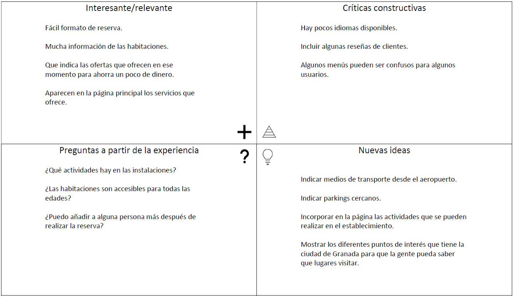
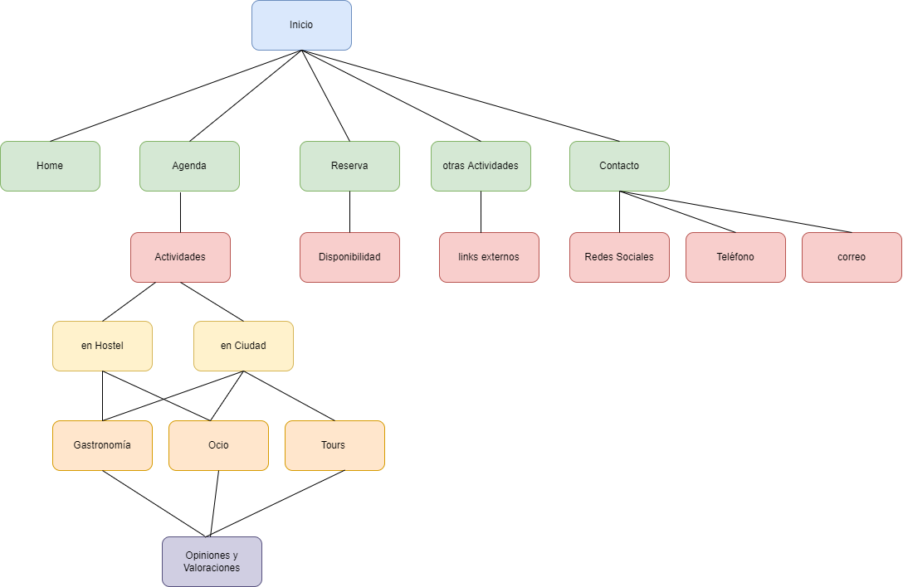

## DIU - Practica2, entregables

### Ideación 
* **Malla receptora de información:** A continuación se puede ver la malla receptora de información que hemos realizado en base a la experiencia que han tenido nuestros personajes (Kumiko y Steven).

### PROPUESTA DE VALOR
* ScopeCanvas

### TASK ANALYSIS

* User Task Matrix 
* User/Task flow

### ARQUITECTURA DE INFORMACIÓN

* Sitemap 

* Labelling 

### Prototipo Lo-FI Wireframe 

### Conclusiones  
(incluye valoración de esta etapa)
