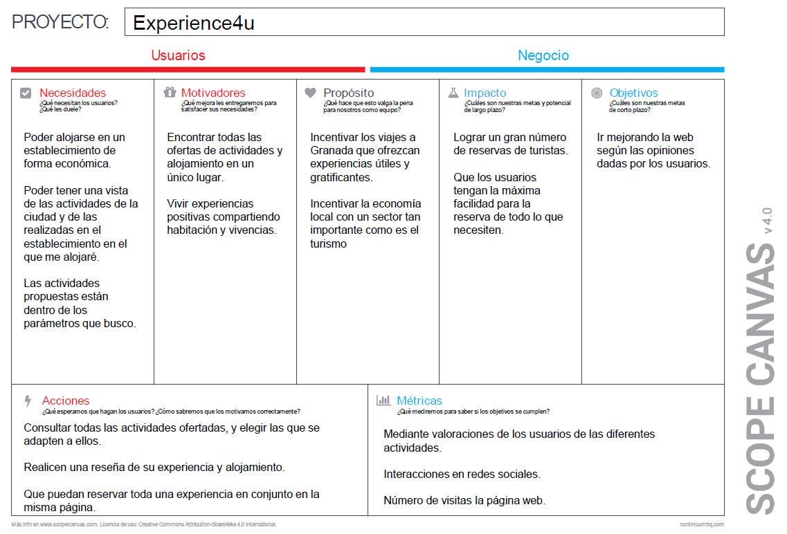

## DIU - Practica2, entregables

### Ideación 
* **Malla receptora de información:** A continuación se puede ver la malla receptora de información que hemos realizado en base a la experiencia que han tenido nuestros personajes (Kumiko y Steven).

### PROPUESTA DE VALOR

En nuestra propuesta de valor presentamos una mejora a la página principal del Hostel añadiendo un microsite en el que aparezcan actividades a realizar. Desde este microsite se puede filtrar por distintos tipos de actividades según su categoría y además se pueden reservar las que son organizadas por el Hostel. También se informa de las actividades ajenas al hostel con información de interés y con enlaces a las páginas oficiales para poder realizar sus reservas si los clientes lo estiman oportuno.

* ScopeCanvas

### TASK ANALYSIS

En nuestra web podemos encontrar usuarios de diversos perfiles, pero lo que creemos que pueden entrar a ver nuestra web pueden ser los sisguientes:
    
- **Jóvenes:** Son las personas más jóvenes. Pueden ser mayores de edad o todavía ser menores de edad.

- **Familias:** Personas convivientes, que suele estar formada por unos padres y unos hijos.

- **Amigos:** Grupo de conocidos que viajan juntos o que se encuentran en el destino para disfrutar de unos días en compañía.

- **Parejas:** Personas jóvenes o adultas que tienen una relación sentimental.

A continuación podemos ver la User Task Matrix creada a partir de los usuarios descritos anteriormente.

| | Jóvenes | Familias | Amigos | Parejas |
| -- | -- | -- | -- | -- |
| Reservar una actividad | H | H | H | H |
| Buscar con filtro | M | H | L | M |
| Hacer una valoración | L | H | M | H |
| Consultar valoraciones | M | H | M | H |
| Pago conjunto | M | H | L | H |
| Compartir una actividad | H | L | H | L |
| Búsqueda de ofertas | H | L | H | M |
| Contactar con la ayuda | M | H | L | M |
| Consultar información adicional | M | H | M | H |
| Conocer personas | H | L | H | L |

Nivel de uso: H (alto), M (medio), L (bajo)

### ARQUITECTURA DE INFORMACIÓN

* Sitemap 

* Labelling 

### Prototipo Lo-FI Wireframe 

