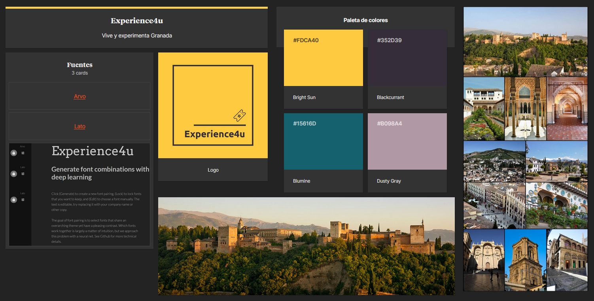

# DIU - Practica 3, entregables

## Moodboard (diseño visual + logotipo)   

En este apartado creamos un Moodboard, es decir, un tablón en el que se incluyen muchos elementos que sirven para el dieseño de nuestro proyecto. En este se incluye el logotipo que hemos creado, una paleta de colores, unas imágenes inspiracionales, una tipografía a usar en nuestros prototipos y los iconos que se usarán en nuestra aplicación.

## Landing Page

## Mockup: LAYOUT HI-FI

## Documentación: Publicación del Case Study

(incluye) Valoración del equipo sobre la realización de esta práctica o los problemas surgidos
 
