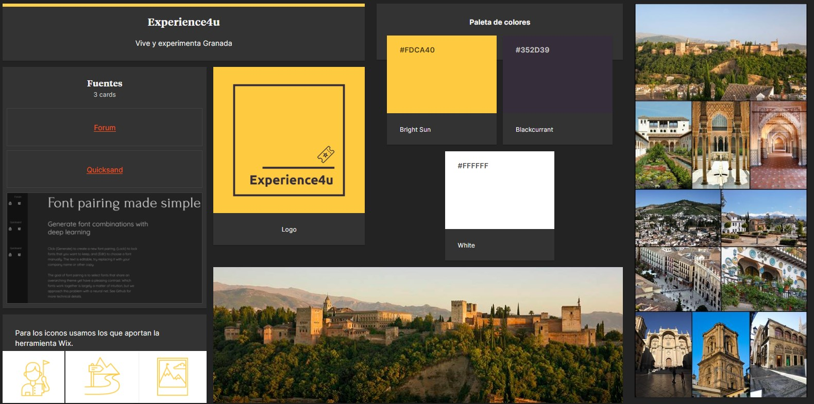
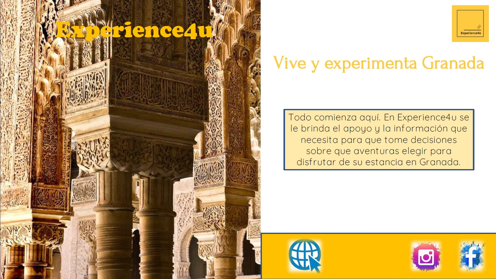
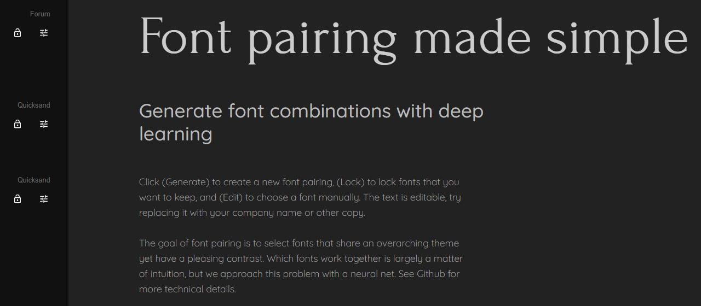
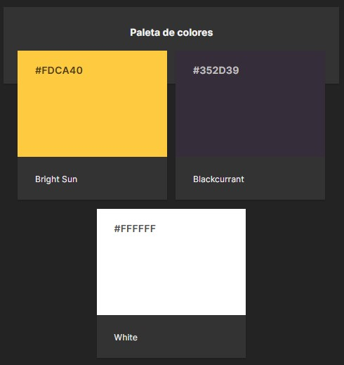

# DIU - Practica 3, entregables

## Moodboard (diseño visual + logotipo)   

En este apartado creamos un Moodboard, es decir, un tablón en el que se incluyen muchos elementos que sirven para el dieseño de nuestro proyecto. En este se incluye el logotipo que hemos creado, una paleta de colores, unas imágenes inspiracionales, una tipografía a usar en nuestros prototipos y los iconos que se usarán en nuestra aplicación.

## Landing Page

En este apartado hemos creado un Lading Page desde promocionamos nuestro sitio web como una solución real y factible al problema a la hora de realizar reservas.

Mediante dicho documento podemos acceder a la página web y redes sociales pulsando los iconos que aparecen.

[>> Puedes ver el Landing Page aquí](Landing_page.pdf)

## 3.c Guidelines
----

Para la tipografía hemos querido elegir unas que sea sencillas, pero a la vez tengan personalidad. Para ello hemos estado mirando en varias páginas, y fimalmente hemos optado por quedarnos con [Forum](https://fonts.google.com/specimen/Forum) para los títulos y con [Quicksand](https://fonts.google.com/specimen/Quicksand) para el texto en general. Ambas tipografías son fáciles de encontrar y de usar. 

En la paleta de colores hemos escogido 3 tonalidades. Hemos querido continuar un poco con los colores presentes en la página del Hostel4u, pero alejarnos un poco de la temática tan oscura que presenta. Por ello hemos elegido el color amarillo que utilizan en su web, para usarlo como tonalidad que llame la atención, y el color blanco para darle ese toque de luminosidad y alegría que caracteriza a nuestra propuesta. Y por último hacemos uso de un color oscuro para botones y otros elementos de la interfaz para que resalte con el blanco. No es una tonalidad negra para no caer en la temática oscura que queremos evitar.

## Mockup: LAYOUT HI-FI

Hemos creado un microservicio en forma de página web, mediante la cual manejamos la tarea de reservas de diversas actividades de ocio y turísticas en la ciudad de Granada, dando a conocer diversos factores como las actividades que se ofrecen, los guías disponibles ...etc.

Para ello hemos hecho uso de la herramienta Wix, que es un sitio que que te ofrece un dominio y una edición muy sencilla de lo que sería una página web sin hacer uso de HTML. 

Se puede acceder a dicha página web a través del Landing Page mostrado anteriormente o a través del siguiente enlace:

[Experience4u](https://esantigilegaza.wixsite.com/experience4u)

## Documentación: Publicación del Case Study

Aquí tenemos un vídeo en el que se muestra como está realizado nuestro Layout. Se puede ver como se realiza la parte de reservar una actividad (acción que no deja realizar si se entra desde el enlace anterior por temas de suscripción).

https://user-images.githubusercontent.com/32387083/169589426-25d1e1ea-e657-4140-bc0c-7df54cf985f2.mp4

Esta práctica ha sido un poco más complicada que las anteriores, pues el proceso de llevar a cabo ya un prototipo mucho más avanzado con varias funcionalidades lleva más trabajo. Hemos tenido algunas complicaciones con Wix, ya que no hemos podido usar Adobe XD, hemos estado buscando alguna herramienta que nos diera la posibilidad de colocar un calendario, pues es el aspecto más importante de nuestra propuesta al ser el mejor medio para poder reservar actividades. Con Wix hemos tenido que usar una versión sin color de nuestro logo, porque solo aceptaba en ese momento imágenes vectoriales.