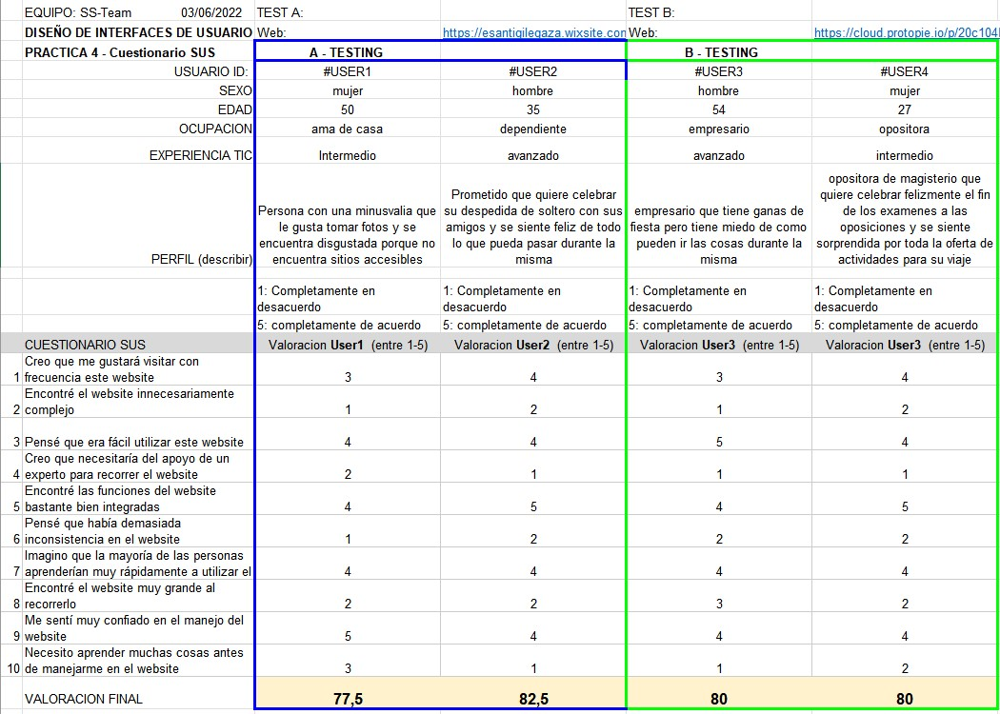

# DIU - Practica 4, entregables

## Caso asignado

Se nos ha asignado el proyecto de nuestros compañeros del grupo [DIU3.3Mosqueteros](https://github.com/mario-gil/DIU) que nos presentan Concerts4UrDinner, que se trata de una app para el móvil, a través de la cual se pueden ver los eventos que están planificados y reservar mesa. Se puede ver información más específica de cada evento y también podremos ver el menú y ofertas.

## Users 

Para el A/B testing hemos elegido a 4 personas ficticias obtenidas mediante el uso de los dados del role-play. Esos usuarios son:
 

| Usuarios | Nombre | Sexo/Edad     | Ocupación   |  Exp.TIC    | Personalidad | Plataforma | TestA/B
| ------------- | -------- | -------- | ----------- | ----------- | -----------  | ---------- | ----
| #USER1  | María | M / 50   | Ama de casa  | Media       | Timida | Web.       | A 
| #USER2  | Lucas | H / 35   | Dependiente  | Avanzada       | Racional       | Web        | A 
| #USER3  | Juan | M / 54   | Empresario     | Avanzada        | Introvertido    | móvil      | B 
| #USER4  | Silvia | H / 27   | Opositora  | Media       | Racional     |Móvil        | B 

## A/B Testing. 

Usaremos el **Cuestionario SUS** para valorar la satisfacción de cada usuario con el diseño (A/B) realizado. Para ello usamos la [hoja de cálculo](Cuestionario_SUS_DIU.xlsx) para calcular resultados siguiendo las pautas para usar la escala SUS e interpretar los resultados

Según los resultados obtenidos en el cuestionario y al observar el microsite de nuestros compañeros, podemos concluir que sus puntos fuertes y débiles son:

- Puntos fuertes: Los usuarios están de acuerdo que presenta una interfaz intuitiva en la que se puede manejar con facilidad y que podrían usar con frecuencia. Por lo que a ello respecta no es un sitio complejo con el que necesites ayuda externa para ser usado.

- Puntos débiles: Algunos usuarios consideran que es grande al recorrerlo, pues tiene muchos menús y puedes perderte en alguno de ellos. También se ve con dificultad el texto que se encuentra por encima de las imágenes.

## Usability Report de Caso B

Para finalizar, aquí se puede ver el [Usability Report](DIU_report-template-usability-testOK.pdf) realizado sobre el proyecto de nuestros compañeros.

## Conclusiones

Después de todo lo observado y basándonos en las opiniones y valoraciones de los usuarios creados, obteniendo en estos una valoración final de 80,  podemos llegar a la conclusión de que la app de nuestros compañeros es sencilla de manejar desde la primera toma de contacto, pues consta de una interfaz bastante intuitiva y cumpliendo sobradamente la finalidad del micro-site, la cual se basaba en el manejo y reservas de actividades a través del hostel.

Así mismo, la app, aunque consta de un bonito diseño y logo, no encaja bien la estética con la página de 4UHostel. Sin embargo esta valoración estética, la podemos dar únicamente para teléfonos móviles, pues no hay disponible una versión de la app para PC en el trabajo de nuestros compañeros. Finalmente, a pesar de estos repuntes que podrían subsanarse, hemos de decir que la app de nuestros compañeros cumple sobradamente con su finalidad y las necesidades de posibles clientes, siendo la experiencia de estos muy satisfactoria.
